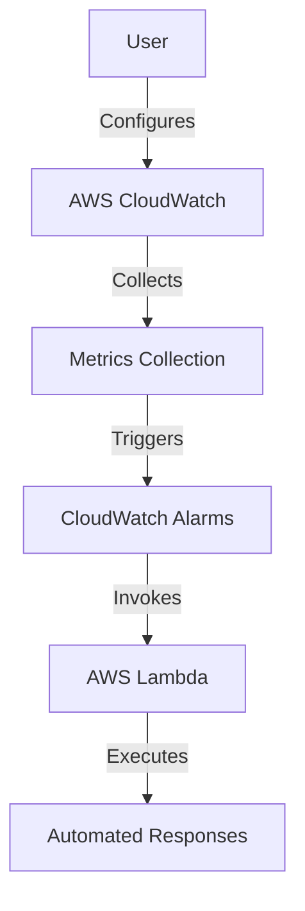
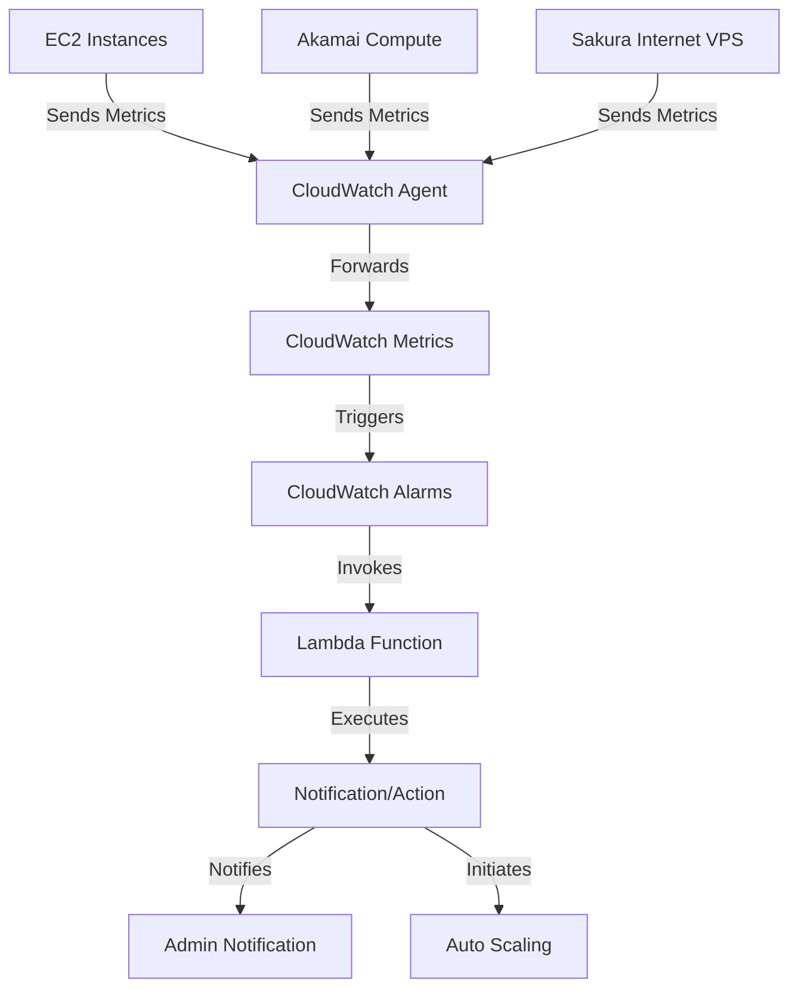
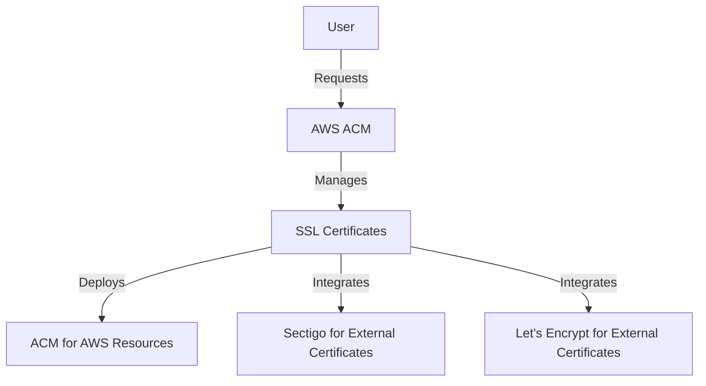
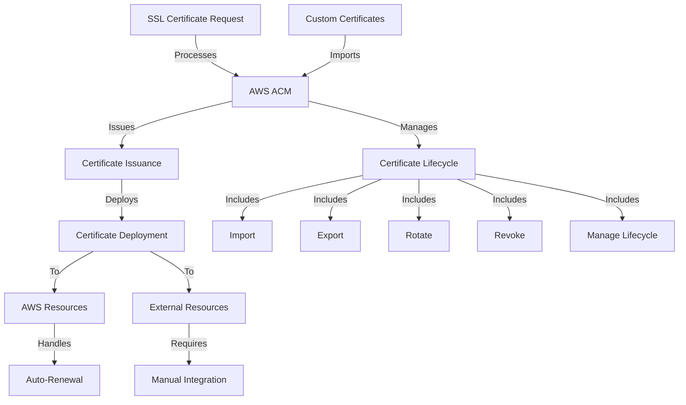
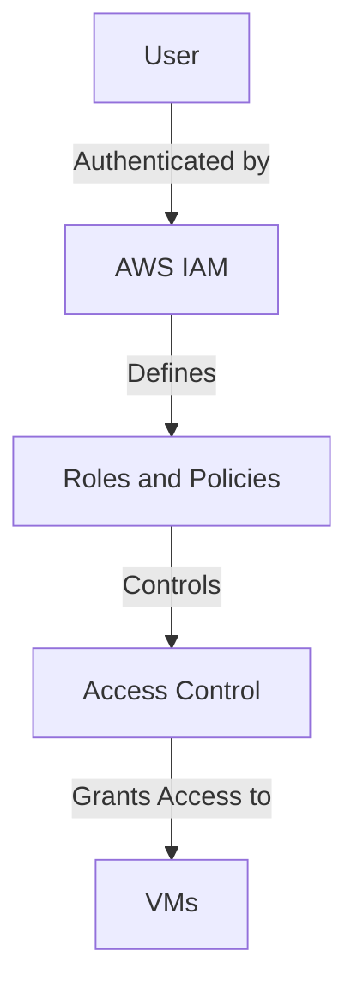
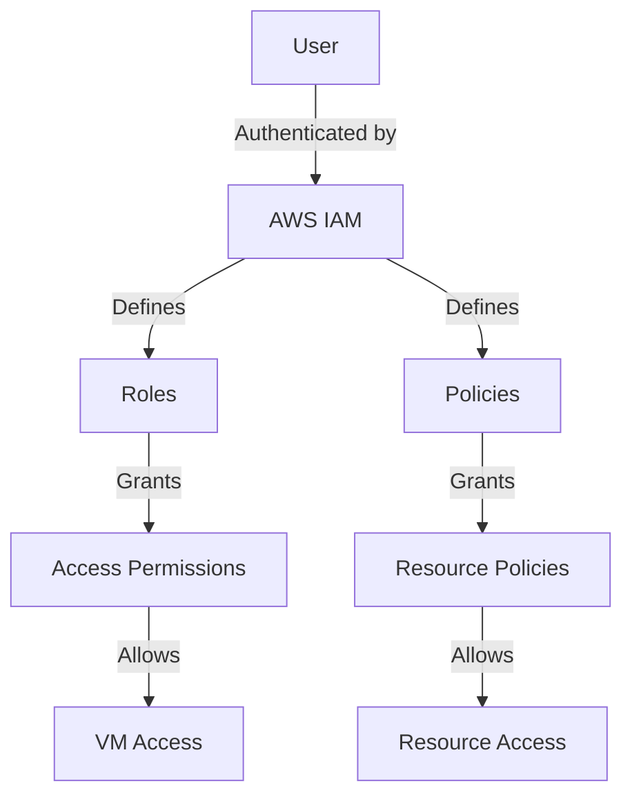
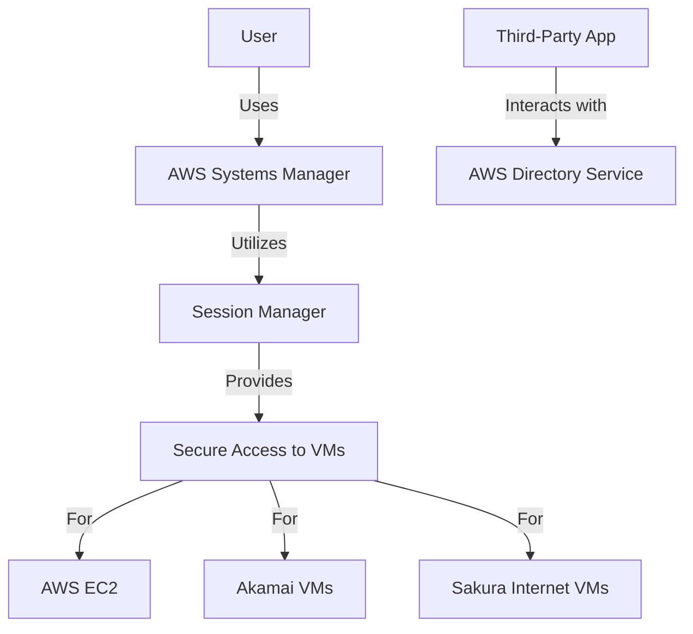
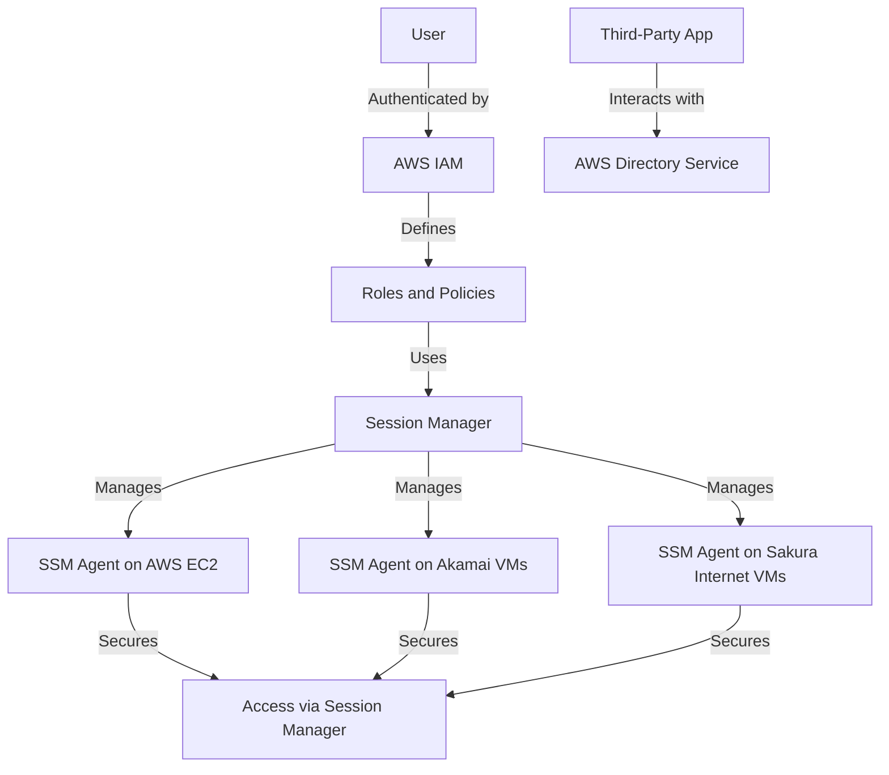
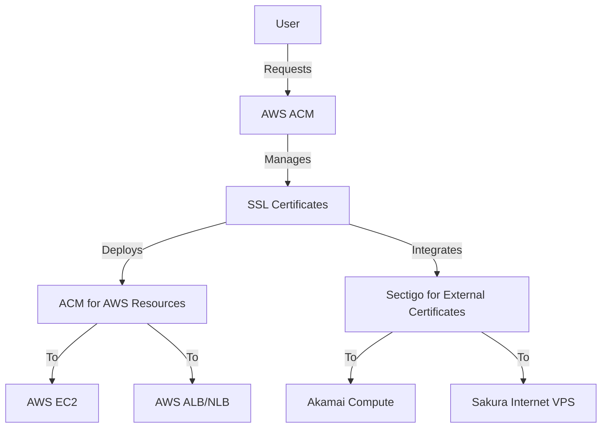
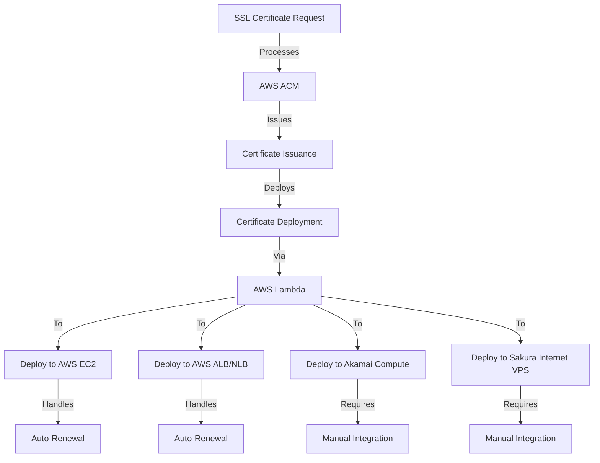

# Technical Proposal for System Implementation

## 1. Introduction
This proposal outlines the implementation of a system with the following core features:
- Monitoring based on specified metrics and reacting to predefined thresholds.
- SSL Certificate management from different sources like Sectigo, AWS ACM.
- User Access Management to secure remote access to Virtual Machines (Linux/Windows) located on AWS, Akamai, and Sakura Internet via SSH/RDP protocols.

## 2. Objectives
- Ensure high availability and cost-effectiveness.
- Utilize AWS Managed Services for ease of maintenance and rapid deployment.
- Secure and efficient management of SSL certificates and user access.

## 3. System Architecture

### 3.1 Monitoring
- **Service**: **AWS CloudWatch**
- **Description**: **AWS CloudWatch** provides a comprehensive monitoring solution that allows you to collect and track metrics, set alarms, and automatically react to changes in your AWS resources and on-premises servers such as Akamai Compute and Sakura Internet VPS. This ensures your infrastructure is always performing at its best.

  - **Convenience**: **AWS CloudWatch** offers a unified view of operational health, enabling you to monitor and manage your entire infrastructure from a single dashboard. This seamless integration simplifies the monitoring process and enhances operational efficiency.
  
  - **Cost-Effective**: With **AWS CloudWatch**, you benefit from a pay-as-you-go pricing model, ensuring you only pay for the metrics and alarms you use. This cost-effective approach allows you to scale your monitoring needs without incurring unnecessary expenses.
  
  - **Reliability**: Built on the resilient AWS infrastructure, **AWS CloudWatch** ensures high reliability and uptime, providing continuous monitoring and alerting capabilities to keep your systems running smoothly.
  
  - **High Availability**: **AWS CloudWatch** operates across multiple AWS regions, offering high availability and ensuring that your monitoring data is always accessible, regardless of where your resources are located.
  
  - **Security (AAA Model)**:
    - **Authentication**: **AWS Identity and Access Management (IAM)** integrates with **CloudWatch** to ensure that only authorized users can access and configure monitoring settings.
    - **Authorization**: Fine-grained access control policies allow you to define who can access specific metrics and alarms, ensuring secure operations.
    - **Accounting**: Detailed logs and audit trails are available to track who accessed what data and when, providing full accountability and transparency.
  
  - **Quick Response**: **CloudWatch Alarms** can trigger **AWS Lambda** functions to automate responses to issues, ensuring rapid mitigation and reducing downtime. This quick response capability ensures that your systems remain operational and performant.

- **Metrics**: CPU usage, memory usage, disk I/O, network traffic.
- **Thresholds**: Define thresholds for each metric to trigger alarms.

#### Overview Diagram

#### Detail Diagram

### 3.2 SSL Certificate Management
- **Service**: **AWS Certificate Manager (ACM)**
- **Description**: **AWS Certificate Manager (ACM)** provides a comprehensive solution for managing SSL/TLS certificates from various sources, including custom certificates from providers like Sectigo and Let's Encrypt. By centralizing your certificates in **AWS ACM**, you can ensure a secure, flexible, and compliant certificate management process.

  - **Trust**: **AWS ACM** is built on AWS's robust infrastructure, ensuring that your certificates are managed in a highly trusted environment. AWS's reputation for security and reliability extends to ACM, providing peace of mind for your certificate management needs.
  
  - **Security**: **AWS ACM** offers advanced security features, including the ability to import private keys and certificates securely. It supports the AAA model:
    - **Authentication**: **AWS IAM** ensures that only authorized users can manage certificates.
    - **Authorization**: Fine-grained access control policies allow you to define who can import, export, rotate, revoke, and manage certificates.
    - **Accounting**: Detailed logs and audit trails track all certificate management activities, ensuring full accountability and transparency.
  
  - **Flexibility**: **AWS ACM** supports the import of custom SSL/TLS certificates from any provider, including Sectigo and Let's Encrypt. This flexibility allows you to centralize all your certificates in a single, secure vault, simplifying management and enhancing security.
  
  - **Ease of Access**: **AWS ACM** provides an intuitive interface for importing, exporting, rotating, revoking, and managing the lifecycle of your certificates. This ease of access ensures that you can efficiently manage your certificates without complex procedures.
  
  - **Compliance**: **AWS ACM** complies with various industry standards and regulations, including PCI DSS, HIPAA, and SOC. By centralizing your certificates in **AWS ACM**, you can ensure that your certificate management practices meet stringent compliance requirements.
  
  - **Automation**: **AWS ACM** automates the renewal and deployment of certificates, reducing the risk of expired certificates and ensuring continuous secure communications. Integration with **AWS Lambda** allows for further automation of custom workflows.

By centralizing your SSL/TLS certificates in AWS ACM, you can leverage AWS's trusted infrastructure, advanced security features, and compliance with industry standards to ensure a secure and efficient certificate management process. This approach simplifies the management of certificates from various providers, providing a single, secure vault for all your SSL/TLS needs.

#### Overview Diagram

#### Detail Diagram

### 3.3 User Access Management
- **Service**: AWS IAM, AWS Systems Manager (SSM), AWS Directory Service
- **Description**: Manage multi-user access to VMs using IAM roles and policies. Use SSM for secure remote access to VMs.

#### Overview Diagram

#### Detail Diagram

### 3.4 Secure Remote Access
- **Service**: AWS Systems Manager (SSM), AWS IAM, AWS Directory Service
- **Description**: Implement best practices for securing remote access to Virtual Machines using SSH and RDP protocols.
- **Approach**:
  - **Users, Groups, Roles, and Permissions**: 
    - Define IAM roles and policies to control access to VMs.
    - Use AWS Directory Service to manage user authentication and authorization.
    - Group users based on their roles and assign appropriate permissions.
    - Automated Management:
      - Use AWS Directory Service APIs to automate user and group management.
      - Implement a wrapper API using AWS SDK to allow external applications to manage users and groups.
  - **Secure Access**:
    - Use AWS Systems Manager Session Manager for secure and auditable SSH and RDP access to VMs.
    - Avoid direct access to VMs over the internet; instead, use SSM to establish secure connections.
  - **Multi-Providers Support**:
    - **AWS EC2 Instances**: Use SSM Agent for remote access.
    - **Akamai and Sakura Internet VMs**:
      - Install the SSM Agent on Akamai and Sakura Internet VMs.
      - Use AWS Systems Manager to manage and access these VMs securely without the need for VPN connections.
  - **Cost-Effectiveness**:
    - Leverage AWS Managed Services to reduce the overhead of managing individual access controls.
    - Automate access management and monitoring to minimize manual intervention.
  - **Automated Command Execution**:
    - Use AWS Systems Manager to execute commands with predefined templates or on-demand to manage and deploy applications or configurations automatically.
    - Support for cron jobs and triggers (e.g., new SSL imported/renewed on AWS ACM) to update remote servers immediately.

 **Feature**                               | **AWS Systems Manager \(Session Manager\)** | **Nagios**                                                 | **Ansible**                                                
-------------------------------------------|---------------------------------------------|------------------------------------------------------------|------------------------------------------------------------
 **Secure Remote Access**                  | Yes                                         | No                                                         | No                                                         
 **Auditable SSH and RDP Access**          | Yes                                         | No                                                         | No                                                         
 **Automated Command Execution**           | Yes                                         | Limited                                                    | Yes                                                        
 **Predefined Templates**                  | Yes                                         | No                                                         | Yes                                                        
 **On\-Demand Command Execution**          | Yes                                         | Limited                                                    | Yes                                                        
 **Cron Jobs and Triggers**                | Yes                                         | No                                                         | Yes                                                        
 **Integration with AWS Services**         | Yes                                         | No                                                         | Limited                                                    
 **Cost\-Effectiveness**                   | Pay\-as\-you\-go                            | Free/Open Source \(requires self\-managed infrastructure\) | Free/Open Source \(requires self\-managed infrastructure\) 
 **Multi\-Provider Support**               | Yes                                         | Yes                                                        | Yes                                                        
 **Centralized User and Group Management** | Yes                                         | No                                                         | No                                                         
 **Third\-Party Application Integration**  | Yes                                         | No                                                         | No                                                                                                        

By leveraging AWS Directory Service and implementing a wrapper API using AWS SDK, along with a third-party application for a user-friendly UI, you can automate the management of users and groups across both Linux and Windows servers. This solution ensures secure, efficient, and centralized access control, making it easier to manage your infrastructure.

#### Overview Diagram

#### Detail Diagram

### 3.5 SSL Certificate Management for Multi-Provider Servers
- **Service**: AWS Certificate Manager (ACM), AWS Lambda
- **Description**: Manage and deploy SSL Certificates to servers hosted on AWS EC2, Akamai Compute, and Sakura Internet VPS. This includes adding, updating, renewing, and regenerating certificates with CSR. Additionally, deploy certificates to AWS Application Load Balancer (ALB) and Network Load Balancer (NLB).
- **Automation**: Use AWS Lambda to automate the deployment and renewal process.

#### Overview Diagram

#### Detail Diagram

### 3.6 Benefits of the Architecture Design
- **Enhanced Security**:
  - Centralized access management using AWS IAM and Directory Service.
  - Secure and auditable access via AWS Systems Manager Session Manager.
  - Reduced attack surface by avoiding direct internet access to VMs.
- **Simplified Management**:
  - Unified access control and monitoring across multiple cloud providers.
  - Automated certificate management and renewal using AWS ACM.
  - Streamlined user authentication and authorization with AWS Directory Service.
- **Cost-Effectiveness**:
  - Reduced operational overhead by leveraging AWS Managed Services.
  - Minimized manual intervention through automation.
  - Efficient resource utilization by integrating multiple cloud providers.
- **High Availability**:
  - Robust monitoring and alerting using AWS CloudWatch.
  - Automated responses to predefined thresholds with AWS Lambda.
  - Reliable and scalable architecture using AWS services.

## 4. Implementation Plan
### 4.1 Monitoring Setup
Detail the steps to set up AWS CloudWatch for monitoring.

### 4.2 SSL Certificate Management
Explain how to implement SSL certificate management using AWS Certificate Manager.

### 4.3 User Access Management
Outline the process for integrating AWS IAM and Directory Service for user access management.

### 4.4 Secure Remote Access
Describe how to ensure secure remote access to VMs using AWS Systems Manager, including the integration with Akamai and Sakura Internet VMs.

## 5. Conclusion
This proposal leverages AWS Managed Services to implement a highly available, cost-effective, and secure system for monitoring, SSL certificate management, and user access management. The use of AWS CloudWatch, ACM, IAM, SSM, and Directory Service ensures ease of maintenance and rapid deployment.

## 6. Next Steps
- Review and approve the proposal.
- Begin implementation with a focus on setting up monitoring and SSL certificate management.
- Gradually integrate user access management and ensure secure remote access to VMs.
- Implement the following objectives:
  - Monitoring based on specified metrics and reacting to predefined thresholds.
  - SSL Certificate management from different sources like Sectigo, AWS ACM.
  - User Access Management to secure remote access to Virtual Machines (Linux/Windows) located on AWS, Akamai, and Sakura Internet via SSH/RDP protocols.
  - Ensure high availability and cost-effectiveness.
  - Utilize AWS Managed Services for ease of maintenance and rapid deployment.
  - Secure and efficient management of SSL certificates and user access.

## 7. Estimated Timeline

| Phase       | Task                                                                 | Duration | Assignee          |
|-------------|----------------------------------------------------------------------|----------|-------------------|
| Preparation | Review and approve the technical proposal                           | 3 weeks  | Product Owner     |
| Preparation | Gather requirements and documentation from stakeholders             | 4.5 weeks| Business Analyst  |
| Preparation | Set up AWS accounts and necessary permissions                       | 1.5 weeks| Senior DevOps Engineer  |
| Preparation | Establish VPN connections between Akamai/Sakura Internet VMs and AWS VPC | 3 weeks  | Senior DevOps Engineer  |
| **Preparation Total** | | **12 weeks** | |
| Design      | Design the architecture for monitoring using AWS CloudWatch         | 3 weeks  | Senior DevOps Engineer |
| Design      | Design the SSL certificate management process using AWS ACM and Sectigo | 3 weeks  | Senior DevOps Engineer |
| Design      | Design the user access management system using AWS IAM, SSM, and Directory Service | 3 weeks  | Senior DevOps Engineer |
| Design      | Design the secure remote access solution using AWS Systems Manager  | 3 weeks  | Senior DevOps Engineer |
| **Design Total** | | **12 weeks** | |
| Architecting| Architect the monitoring solution with CloudWatch Alarms and AWS Lambda | 4.5 weeks| Senior DevOps Engineer   |
| Architecting| Architect the SSL certificate management workflow, including automation with AWS Lambda | 4.5 weeks| Senior DevOps Engineer   |
| Architecting| Architect the user access management roles, policies, and permissions | 4.5 weeks| Senior DevOps Engineer   |
| Architecting| Architect the secure remote access setup for AWS, Akamai, and Sakura Internet VMs | 4.5 weeks| Senior DevOps Engineer   |
| **Architecting Total** | | **18 weeks** | |
| Execution   | Implement the monitoring setup with AWS CloudWatch                  | 6 weeks  | Full Stack Developer   |
| Execution   | Implement the SSL certificate management system with AWS ACM and Sectigo | 6 weeks  | Full Stack Developer   |
| Execution   | Implement the user access management system with AWS IAM, SSM, and Directory Service | 6 weeks  | Full Stack Developer   |
| Execution   | Implement the secure remote access solution using AWS Systems Manager | 6 weeks  | Full Stack Developer   |
| **Execution Total** | | **24 weeks** | |
| QC & QA     | Test the monitoring setup to ensure metrics are collected and alarms are triggered correctly | 3 weeks  | QA/QC       |
| QC & QA     | Test the SSL certificate management process, including issuance, deployment, and renewal | 3 weeks  | QA/QC       |
| QC & QA     | Test the user access management system to ensure proper authentication and authorization | 3 weeks  | QA/QC       |
| QC & QA     | Test the secure remote access solution to ensure secure and auditable access to VMs | 3 weeks  | QA/QC       |
| **QC & QA Total** | | **12 weeks** | |
| Release     | Prepare release documentation and user guides                       | 1.5 weeks| Business Analyst  |
| Release     | Conduct a final review and approval process                         | 1.5 weeks| Product Owner     |
| Release     | Deploy the solution to production                                   | 1.5 weeks| Senior DevOps Engineer   |
| Release     | Monitor the system post-deployment to ensure stability and performance | 3 weeks  | Senior DevOps Engineer   |
| **Release Total** | | **7.5 weeks** | |
| **Grand Total** | | **85.5 weeks** | |

## 8. References
- [AWS CloudWatch Documentation](https://docs.aws.amazon.com/cloudwatch/)
- [AWS Certificate Manager Documentation](https://docs.aws.amazon.com/acm/)
- [AWS IAM Documentation](https://docs.aws.amazon.com/iam/)
- [AWS Systems Manager Documentation](https://docs.aws.amazon.com/systems-manager/)
- [AWS Directory Service Documentation](https://docs.aws.amazon.com/directoryservice/)