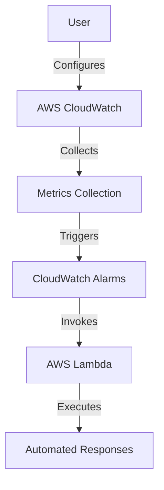
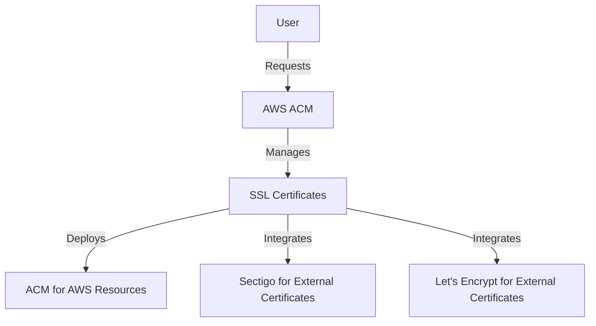
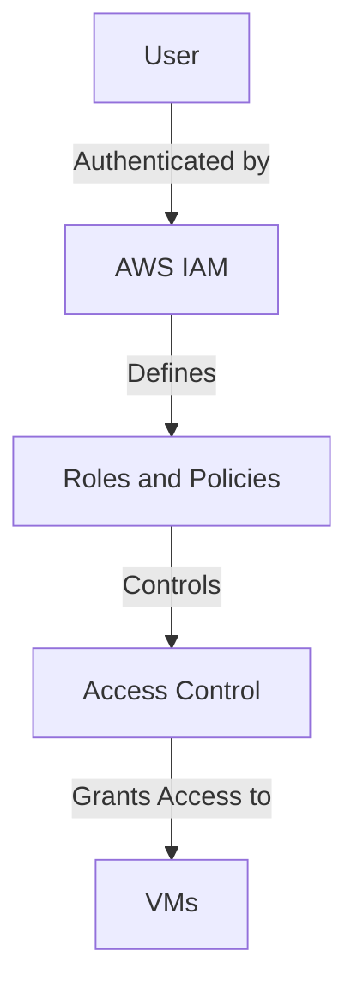
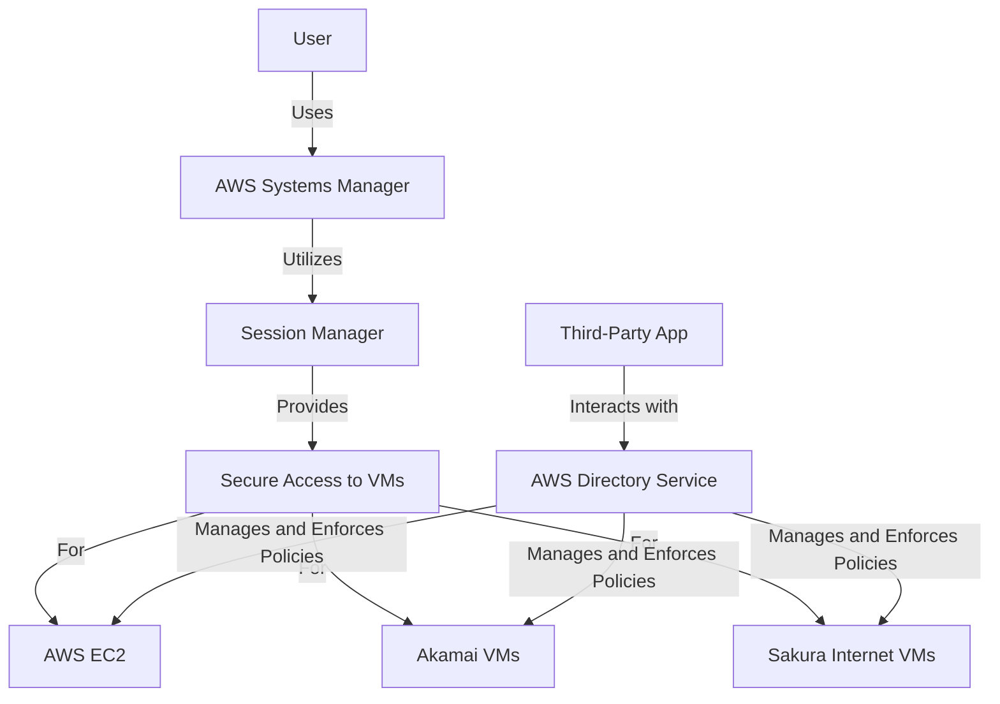
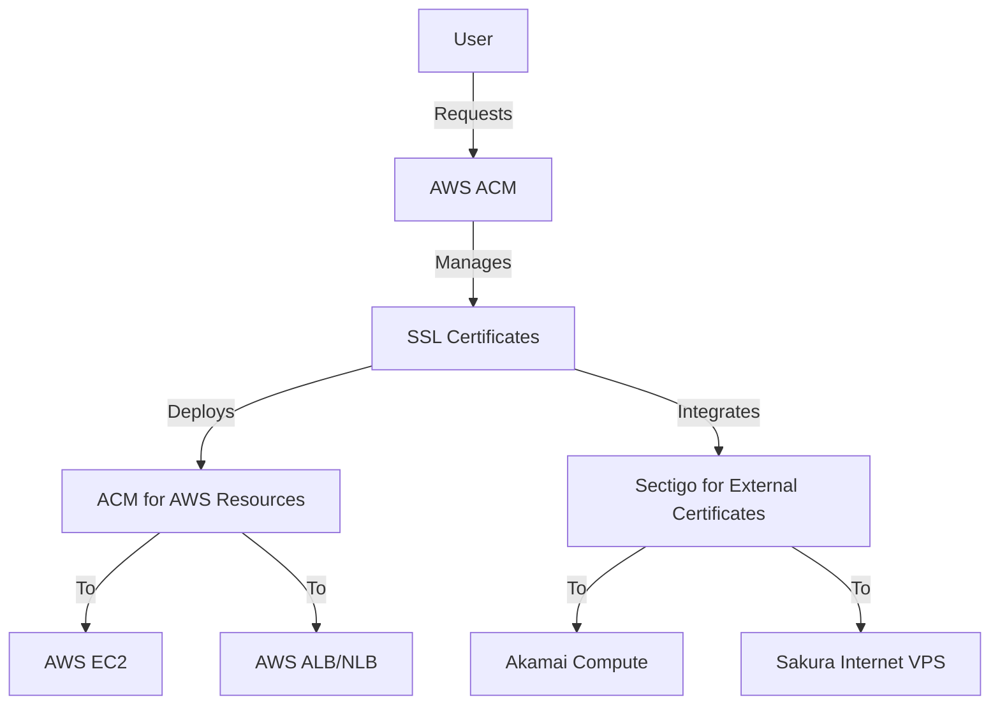

# Technical Proposal 

### 1. Monitoring
- **Service**: **AWS CloudWatch**
- **Description**: **AWS CloudWatch** provides a comprehensive monitoring solution that allows you to collect and track metrics, set alarms, and automatically react to changes in your AWS resources and on-premises servers such as Akamai Compute and Sakura Internet VPS. This ensures your infrastructure is always performing at its best.

  - **Convenience**: **AWS CloudWatch** offers a unified view of operational health, enabling you to monitor and manage your entire infrastructure from a single dashboard. This seamless integration simplifies the monitoring process and enhances operational efficiency.
  
  - **Cost-Effective**: With **AWS CloudWatch**, you benefit from a pay-as-you-go pricing model, ensuring you only pay for the metrics and alarms you use. This cost-effective approach allows you to scale your monitoring needs without incurring unnecessary expenses.
  
  - **Reliability**: Built on the resilient AWS infrastructure, **AWS CloudWatch** ensures high reliability and uptime, providing continuous monitoring and alerting capabilities to keep your systems running smoothly.
  
  - **High Availability**: **AWS CloudWatch** operates across multiple AWS regions, offering high availability and ensuring that your monitoring data is always accessible, regardless of where your resources are located.
  
  - **Security (AAA Model)**:
    - **Authentication**: **AWS Identity and Access Management (IAM)** integrates with **CloudWatch** to ensure that only authorized users can access and configure monitoring settings.
    - **Authorization**: Fine-grained access control policies allow you to define who can access specific metrics and alarms, ensuring secure operations.
    - **Accounting**: Detailed logs and audit trails are available to track who accessed what data and when, providing full accountability and transparency.
  
  - **Quick Response**: **CloudWatch Alarms** can trigger **AWS Lambda** functions to automate responses to issues, ensuring rapid mitigation and reducing downtime. This quick response capability ensures that your systems remain operational and performant.

- **Metrics**: CPU usage, memory usage, disk I/O, network traffic.
- **Thresholds**: Define thresholds for each metric to trigger alarms.

#### Overview Diagram

## Comparison of Metrics Monitoring Services

| Feature/Service                | AWS CloudWatch                          | Graphite Stack                        | Prometheus Stack                      | Zabbix Stack                          | Nagios Stack                          |
|--------------------------------|-----------------------------------------|---------------------------------------|---------------------------------------|---------------------------------------|---------------------------------------|
| **Data Collection**            | Native AWS integration, custom metrics  | Custom metrics, integrations          | Custom metrics, integrations          | Custom metrics, integrations          | Custom metrics, integrations          |
| **Storage**                    | Managed, scalable                       | Local or distributed storage          | Local or remote storage               | Local or distributed storage          | Local or distributed storage          |
| **Query Language**             | CloudWatch Metrics Insights             | Graphite Query Language               | PromQL                                | Zabbix Query Language                 | Nagios Query Language                 |
| **Alerting**                   | CloudWatch Alarms                       | Grafana, custom scripts               | Alertmanager                          | Built-in alerting                     | Built-in alerting                     |
| **Visualization**              | CloudWatch Dashboards                   | Grafana                               | Grafana                               | Zabbix Dashboards                     | Nagios Dashboards                     |
| **Scalability**                | Highly scalable, managed by AWS         | Scalable with additional setup        | Highly scalable                       | Scalable with additional setup        | Scalable with additional setup        |
| **High Availability**          | Multi-region support                    | Requires additional setup             | Built-in support                      | Requires additional setup             | Requires additional setup             |
| **Authentication & Authorization** | IAM integration, fine-grained policies | Basic authentication, custom solutions | Basic authentication, custom solutions | Built-in user roles and permissions   | Basic authentication, custom solutions|
| **Cost**                       | Pay-as-you-go                           | Open-source, infrastructure costs     | Open-source, infrastructure costs     | Open-source, infrastructure costs     | Open-source, infrastructure costs     |
| **Ease of Setup**              | Easy, managed by AWS                    | Requires setup and configuration      | Requires setup and configuration      | Requires setup and configuration      | Requires setup and configuration      |
| **Integration with Other Tools** | Native AWS services                    | Integrations via plugins              | Integrations via exporters            | Integrations via plugins              | Integrations via plugins              |
| **Community & Support**        | AWS support, extensive documentation    | Community support, documentation      | Community support, documentation      | Community support, documentation      | Community support, documentation      |
| **Custom Metrics**             | Supported                               | Supported                             | Supported                             | Supported                             | Supported                             |
| **Retention Policy**           | Configurable                            | Configurable                          | Configurable                          | Configurable                          | Configurable                          |
| **Data Granularity**           | High                                    | High                                  | High                                  | High                                  | High                                  |
| **Automation**                 | Lambda integration for automated responses | Custom scripts                        | Alertmanager for automated responses  | Custom scripts                        | Custom scripts                        |
| **Self-Hosted & Self-Managed** | No                                      | Yes                                   | Yes                                   | Yes                                   | Yes                                   |
| **Risk of Downtime**           | Low, managed by AWS                     | Medium, depends on setup              | Medium, depends on setup              | Medium, depends on setup              | Medium, depends on setup              |
| **High Availability & Scalability** | Easy, managed by AWS                    | Hard, requires significant effort     | Hard, requires significant effort     | Hard, requires significant effort     | Hard, requires significant effort     |
| **Benefit for AWS Resources**  | Excellent, native integration           | None                                  | None                                  | None                                  | None                                  |
| **Pros**                       | Fully managed, easy to use, scalable, excellent for AWS resources, centralized monitoring for hybrid environments | Flexible, open-source, customizable   | Powerful query language, open-source  | Comprehensive monitoring, open-source | Extensive plugin ecosystem, open-source |
| **Cons**                       | Cost can add up, AWS lock-in            | Requires significant setup and maintenance | Requires significant setup and maintenance | Requires significant setup and maintenance | Requires significant setup and maintenance |
| **Reasons to Use AWS CloudWatch** | - Native integration with AWS services - Centralized monitoring for hybrid environments - Managed service reduces operational complexity - Scalable and highly available - Extensive support and documentation | - Open-source, customizable - Requires self-management - Suitable for specific use cases | - Open-source, powerful query language - Requires self-management - Suitable for specific use cases | - Open-source, comprehensive monitoring - Requires self-management - Suitable for specific use cases | - Open-source, extensive plugin ecosystem - Requires self-management - Suitable for specific use cases |

### 2. SSL Certificate Management
- **Service**: **AWS Certificate Manager (ACM)**
- **Description**: **AWS Certificate Manager (ACM)** provides a comprehensive solution for managing SSL/TLS certificates from various sources, including custom certificates from providers like Sectigo and Let's Encrypt. By centralizing your certificates in **AWS ACM**, you can ensure a secure, flexible, and compliant certificate management process.

  - **Trust**: **AWS ACM** is built on AWS's robust infrastructure, ensuring that your certificates are managed in a highly trusted environment. AWS's reputation for security and reliability extends to ACM, providing peace of mind for your certificate management needs.
  
  - **Security**: **AWS ACM** offers advanced security features, including the ability to import private keys and certificates securely. It supports the AAA model:
    - **Authentication**: **AWS IAM** ensures that only authorized users can manage certificates.
    - **Authorization**: Fine-grained access control policies allow you to define who can import, export, rotate, revoke, and manage certificates.
    - **Accounting**: Detailed logs and audit trails track all certificate management activities, ensuring full accountability and transparency.
  
  - **Flexibility**: **AWS ACM** supports the import of custom SSL/TLS certificates from any provider, including Sectigo and Let's Encrypt. This flexibility allows you to centralize all your certificates in a single, secure vault, simplifying management and enhancing security.
  
  - **Ease of Access**: **AWS ACM** provides an intuitive interface for importing, exporting, rotating, revoking, and managing the lifecycle of your certificates. This ease of access ensures that you can efficiently manage your certificates without complex procedures.
  
  - **Compliance**: **AWS ACM** complies with various industry standards and regulations, including PCI DSS, HIPAA, and SOC. By centralizing your certificates in **AWS ACM**, you can ensure that your certificate management practices meet stringent compliance requirements.
  
  - **Automation**: **AWS ACM** automates the renewal and deployment of certificates, reducing the risk of expired certificates and ensuring continuous secure communications. Integration with **AWS Lambda** allows for further automation of custom workflows.

By centralizing your SSL/TLS certificates in AWS ACM, you can leverage AWS's trusted infrastructure, advanced security features, and compliance with industry standards to ensure a secure and efficient certificate management process. This approach simplifies the management of certificates from various providers, providing a single, secure vault for all your SSL/TLS needs.

#### Overview Diagram

## Comparison of SSL Certificate Management Services

| Feature/Service                | AWS ACM                                | Sectigo Certificate Manager           | HashiCorp Vault                       |
|--------------------------------|----------------------------------------|---------------------------------------|---------------------------------------|
| **Service Type**               | Managed                                | Managed                               | Self-hosted, Self-managed             |
| **Integration**                | Native AWS integration                 | Wide range of integrations            | API-based integrations                |
| **Certificate Issuance**       | Automated                              | Automated                             | Automated                             |
| **Certificate Renewal**        | Automated                              | Automated                             | Automated                             |
| **Certificate Revocation**     | Supported                              | Supported                             | Supported                             |
| **Custom Certificates**        | Supported                              | Supported                             | Supported                             |
| **Certificate Types**          | DV, OV, EV                             | DV, OV, EV                            | DV, OV, EV                            |
| **Scalability**                | Highly scalable, managed by AWS        | Scalable, managed by Sectigo          | Scalable with additional setup        |
| **High Availability**          | Multi-region support                   | High availability, managed by Sectigo | Requires additional setup             |
| **Authentication & Authorization** | IAM integration, fine-grained policies | Role-based access control             | Role-based access control             |
| **Cost**                       | Pay-as-you-go                          | Subscription-based                    | Open-source, enterprise pricing       |
| **Ease of Setup**              | Easy, managed by AWS                   | Easy, managed by Sectigo              | Requires setup and configuration      |
| **Management Interface**       | AWS Management Console, CLI, API       | Web interface, API                    | CLI, API, Web UI (Enterprise)         |
| **Compliance**                 | PCI DSS, HIPAA, SOC, ISO               | PCI DSS, HIPAA, SOC, ISO              | PCI DSS, HIPAA, SOC, ISO (Enterprise) |
| **Community & Support**        | AWS support, extensive documentation   | Sectigo support, documentation        | Community support, enterprise support |
| **Use Case**                   | Best for AWS-centric environments      | Suitable for various environments     | Suitable for highly secure environments|
| **Pros**                       | Fully managed, easy to use, scalable, excellent for AWS resources | Wide range of integrations, managed service | Highly secure, flexible, open-source  |
| **Cons**                       | AWS lock-in, cost can add up           | Subscription cost, dependency on Sectigo | Requires significant setup and maintenance |
| **Reasons to Use**             | - Native integration with AWS services - Automated management reduces operational complexity - Scalable and highly available - Extensive support and documentation - Centralized management for hybrid environments (AWS, Akamai, On-Premises) - Simplifies SSL certificate management across hybrid infrastructure | - Wide range of integrations - Managed service reduces operational complexity - High availability - Extensive support and documentation | - Highly secure - Flexible and customizable - Open-source with enterprise options - Suitable for highly secure environments |

### 3. User Access Management
- **Service**: AWS IAM, AWS Systems Manager (SSM), AWS Directory Service
- **Description**: Manage multi-user access to VMs using IAM roles and policies. Use SSM for secure remote access to VMs.

#### Overview Diagram

### 4. Secure Remote Access
- **Service**: AWS Systems Manager (SSM), AWS IAM, AWS Directory Service
- **Description**: Implement best practices for securing remote access to Virtual Machines using SSH and RDP protocols.
- **Approach**:
  - **Users, Groups, Roles, and Permissions**: 
    - Define IAM roles and policies to control access to VMs.
    - Use AWS Directory Service to manage user authentication and authorization.
    - Group users based on their roles and assign appropriate permissions.
    - Automated Management:
      - Use AWS Directory Service APIs to automate user and group management.
      - Implement a wrapper API using AWS SDK to allow external applications to manage users and groups.
  - **Secure Access**:
    - Use AWS Systems Manager Session Manager for secure and auditable SSH and RDP access to VMs.
    - Avoid direct access to VMs over the internet; instead, use SSM to establish secure connections.
  - **Multi-Providers Support**:
    - **AWS EC2 Instances**: Use SSM Agent for remote access.
    - **Akamai and Sakura Internet VMs**:
      - Install the SSM Agent on Akamai and Sakura Internet VMs.
      - Use AWS Systems Manager to manage and access these VMs securely without the need for VPN connections.
  - **Cost-Effectiveness**:
    - Leverage AWS Managed Services to reduce the overhead of managing individual access controls.
    - Automate access management and monitoring to minimize manual intervention.
  - **Automated Command Execution**:
    - Use AWS Systems Manager to execute commands with predefined templates or on-demand to manage and deploy applications or configurations automatically.
    - Support for cron jobs and triggers (e.g., new SSL imported/renewed on AWS ACM) to update remote servers immediately.

 **Feature**                               | **AWS Systems Manager** | **Nagios**                                                 | **Ansible**                                                
-------------------------------------------|---------------------------------------------|------------------------------------------------------------|------------------------------------------------------------
 **Secure Remote Access**                  | Yes                                         | No                                                         | No                                                         
 **Auditable SSH and RDP Access**          | Yes                                         | No                                                         | No                                                         
 **Automated Command Execution**           | Yes                                         | Limited                                                    | Yes                                                        
 **Predefined Templates**                  | Yes                                         | No                                                         | Yes                                                        
 **On\-Demand Command Execution**          | Yes                                         | Limited                                                    | Yes                                                        
 **Cron Jobs and Triggers**                | Yes                                         | No                                                         | Yes                                                        
 **Integration with AWS Services**         | Yes                                         | No                                                         | Limited                                                    
 **Cost-Effectiveness**                   | Pay-as-you-go                            | Free/Open Source (requires self-managed infrastructure) | Free/Open Source (requires self-managed infrastructure) 
 **Multi-Provider Support**               | Yes                                         | Yes                                                        | Yes                                                        
 **Centralized User and Group Management** | Yes                                         | No                                                         | No                                                         
 **Third-Party Application Integration**  | Yes                                         | No                                                         | No                                                                                                        

By leveraging AWS Directory Service and implementing a wrapper API using AWS SDK, along with a third-party application for a user-friendly UI, you can automate the management of users and groups across both Linux and Windows servers. This solution ensures secure, efficient, and centralized access control, making it easier to manage your infrastructure.

#### Overview Diagram

### 5. SSL Certificate Management for Multi-Provider Servers
- **Service**: AWS Certificate Manager (ACM), AWS Lambda
- **Description**: Manage and deploy SSL Certificates to servers hosted on AWS EC2, Akamai Compute, and Sakura Internet VPS. This includes adding, updating, renewing, and regenerating certificates with CSR. Additionally, deploy certificates to AWS Application Load Balancer (ALB) and Network Load Balancer (NLB).
- **Automation**: Use AWS Lambda to automate the deployment and renewal process.

#### Overview Diagram

### 6. Benefits of this Design
- **Enhanced Security**:
  - Centralized access management using AWS IAM and Directory Service.
  - Secure and auditable access via AWS Systems Manager Session Manager.
  - Reduced attack surface by avoiding direct internet access to VMs.
- **Simplified Management**:
  - Unified access control and monitoring across multiple cloud providers.
  - Automated certificate management and renewal using AWS ACM.
  - Streamlined user authentication and authorization with AWS Directory Service.
- **Cost-Effectiveness**:
  - Reduced operational overhead by leveraging AWS Managed Services.
  - Minimized manual intervention through automation.
  - Efficient resource utilization by integrating multiple cloud providers.
- **High Availability**:
  - Robust monitoring and alerting using AWS CloudWatch.
  - Automated responses to predefined thresholds with AWS Lambda.
  - Reliable and scalable architecture using AWS services.
